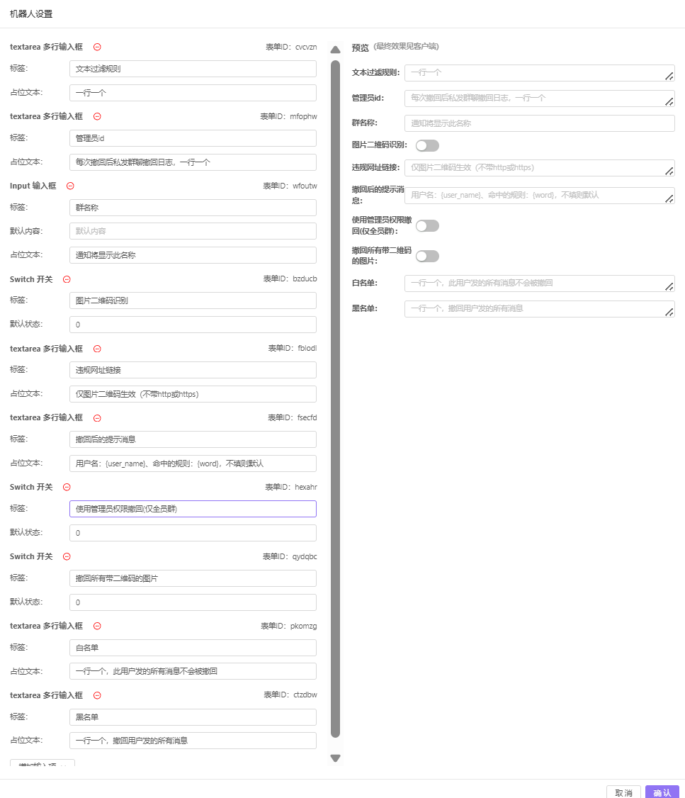

# 云湖敏感词bot
*群管理难？总是有广告哥来群里捣乱？*

来试试云湖敏感词bot帮助你管理群聊！

* 支持图片二维码识别
* 支持敏感词正则表达式
* 支持顶级域以及子域屏蔽（例如*.top）
* 支持自定义撤回后的提示消息

- 默认监听http://server_ip:56669/yhchat

>部署示例：
>下载main.py后
>在当前目录下新建一个.env
>然后填写
>```
>ID_1=<表单id>
>…………
>ID_8=<表单id>
>TOKEN=<机器人token>
>
>python main.py

* 表单示例



- 使用管理员权限撤回涉及到用户token，所以一般情况下不需要添加